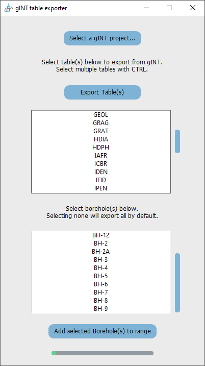

# GintTableExporter 
GUI to extract tables from gINT (a geotechnical database, ) to excel files.
  

#### How to extract tables from gINT:
     - Open a gINT project file
     
     - Selecting invidivdual locations:
       - By default, all PointID records from POINT table will be exported, even if none are selected
       - If individual locations are required:
         - First, select them from the bottom listbox (before selecting tables) 
         - Click 'Add selected Borehole(s) to range'
         
     - Select tables required for export from the toplist box
       - Select multiple tables with Shift + Click
       - Select individual tables CTRL + Click
       - Select all tables with CTRL + A
       
     - Click 'Export Table(s)' and navigate to a directory to save the exported excel file

 

 

 - [Select a gINT project](#select-a-gint-project)
 - [Export Tables](#export-tables)
 - [Add selected Boreholes to range](#add-selected-boreholes-to-range)

#### Select a gINT project
  - Loads the tables and location names a gINT project
    - Uses the 64-bit Microsoft Access Driver.
    - Utilises SQL queries to extract data.

#### Export Tables
  - Loads all tables from gINT, after deleting microsoft access system tables
    - More tables can be from omitted inside the self.get_file_location() function
    - Looks for special unicode characters to omit system tables

#### Add selected Boreholes to range
  - Filter locations (PointID records) from the POINT table 
    - By default, all PointID records are exported, unless the user specifies individual locations

  

##### Anton [(lachesis17)](https://github.com/lachesis17) 🪐
